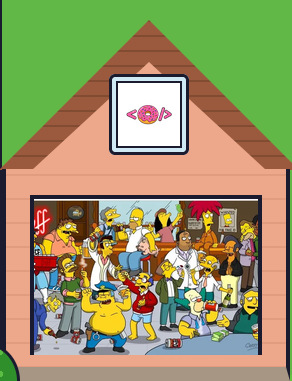
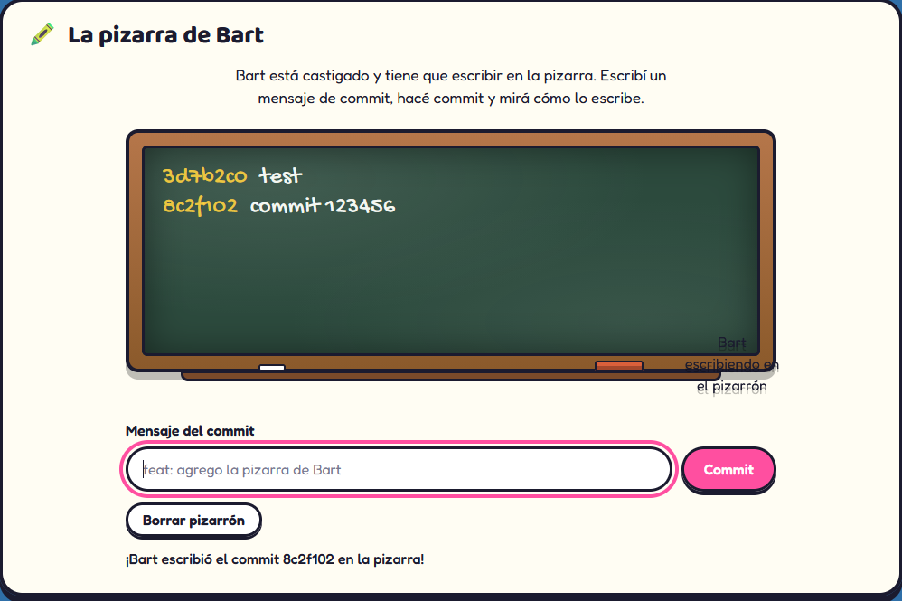
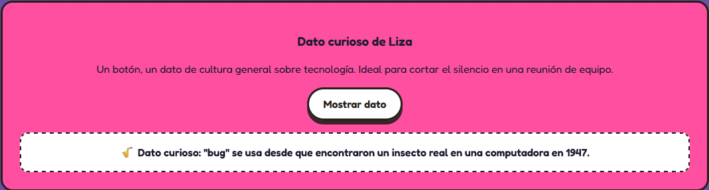
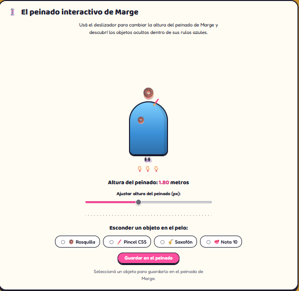
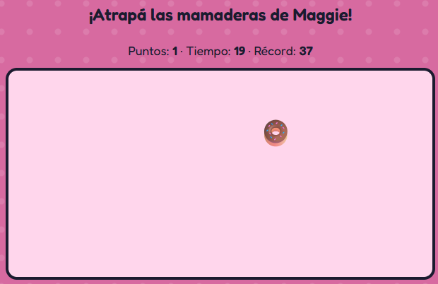

# Donuts & Code

Landing del grupo **Donuts & Code**, con tematica de Los Simpsons: la portada es la casa de la familia, cada ventana es la tarjeta de un integrante y lleva a su perfil, y la central nuclear del fondo lleva a la bitacora del proyecto.

**Link Vercel:** https://frontend-grupo-16-pi.vercel.app/

**Repositorio Github:** https://github.com/IgnacioMiguelPenovi/Frontend-Grupo-16.git

## Integrantes

| Nombre | Perfil en el sitio | GitHub |
|---|---|---|
| Ignacio Miguel Penovi | [bart.html](bart.html) | https://github.com/IgnacioMiguelPenovi |
| Ester | [lisa.html](lisa.html) | https://github.com/Kira-Blan |
| Eliana Moguilevsky | [marge.html](marge.html) | https://github.com/ElianaMoguilevsky |
| Celeste | [maggie.html](maggie.html) | https://github.com/mcdileonardo-alt |

## Tecnologías utilizadas
* **HTML5 Semántico:** Estructura limpia y accesible (`<header>`, `<nav>`, `<main>`, `<section>`, `<article>`, `<footer>`).
* **CSS3 Custom (Nativo):** Maquetado fluido con Flexbox, CSS Grid y variables CSS.
* **JavaScript ES6+:** Manipulación del DOM, eventos, animaciones y persistencia con `localStorage`.
* **Google Fonts:** Tipografías temáticas externas.

## Guía de estilos e identidad visual
* **Tipografías:** `Baloo 2` (títulos y encabezados) y `Fredoka` (texto principal).
* **Paleta de Colores (Springfield):**
  * Amarillo Simpson (Acentos): `#FED90F`
  * Azul Cielo (Hero/Fondo): `#70D1F4`
  * Rosa Rosquilla (CTAs): `#FF4FA0`
  * Tinta Oscura (Bordes/Contornos): `#1B1B2F`
  * Papel/Fondo Claro: `#FFFDF3`

## Estructura del proyecto

```
.
├── index.html        Portada (la casa)
├── bitacora.html      Bitacora del proyecto
├── bart.html          Perfil de Ignacio
├── lisa.html          Perfil de Ester
├── marge.html         Perfil de Eliana
├── maggie.html        Perfil de Celeste
├── css/                Una hoja de estilos por pantalla/seccion
├── js/                 JavaScript del sitio (index.js)
└── img/                Imagenes, avatares e iconos
```

Cada pagina HTML vive en la raiz del repositorio. El CSS, el JavaScript y las imagenes estan separados en sus propias carpetas y son compartidos por todas las paginas.

## Navegacion

Todas las paginas tienen, en la barra superior, un link a la portada ("La casa") y uno a la bitacora. Ademas, cada perfil tiene una seccion "Visita otras habitaciones" con enlaces directos a los perfiles del resto del equipo. Nadie necesita usar el boton Atras del navegador para recorrer el sitio.

## Interacciones dinamicas (JavaScript)

Todo el JavaScript del sitio esta centralizado en `js/index.js`. Cada funcion se activa solo cuando encuentra en la pagina los elementos que le corresponden, asi un mismo archivo sirve para todas las paginas sin que se pisen entre si.

- **Portada (`index.html`):** el garage de la casa se abre al hacer clic en la puerta y muestra la escena escondida adentro; un segundo clic lo vuelve a cerrar.

  

- **Perfil de Ignacio (`bart.html`):** la pizarra de Bart. Se escribe un mensaje de commit en un input y, al confirmarlo, Bart lo escribe letra por letra en el pizarron del salon, con un hash corto adelante como si fuera un commit real. El pizarron guarda hasta 6 mensajes y los recuerda entre visitas (`localStorage`).

  

- **Perfil de Ester (`lisa.html`):** un boton que muestra un dato curioso de programacion al azar, elegido de una lista fija.

  

- **Perfil de Eliana (`marge.html`):** el peinado interactivo de Marge. Un slider controla la altura del peinado y va revelando objetos escondidos adentro a medida que sube.

  

- **Perfil de Celeste (`maggie.html`):** un minijuego de 20 segundos donde hay que atrapar las mamaderas que van apareciendo en pantalla (y, de vez en cuando, una dona que vale mas puntos). El puntaje y el tiempo se actualizan en vivo, y el mejor puntaje queda guardado entre visitas (`localStorage`).

  

## Diseno responsive

El sitio usa tres breakpoints en todas las paginas:

- `400px`: ajustes para telefonos chicos.
- `900px`: la casa y las tarjetas pasan de una grilla a una columna.
- `1200px`: en pantallas de notebook, el contenido se angosta un poco respecto del ancho maximo de escritorio.

## Bitacora

Las decisiones, dificultades y cambios del proyecto se fueron registrando en [bitacora.html](bitacora.html), accesible desde el menu principal de cualquier pagina.

## Evolución del proyecto

En futuros trabajos se continuara ampliando y mejorando el proyecto mediante:

- Incorporacion de nuevas funcionalidades.
- Mejoras en el diseño y la experiencia de usuario.
- Adaptacion y optimizacion para diferentes dispositivos.
- Incorporacion de nuevas secciones y perfiles de personajes.
- Implementacion de funcionalidades dinámicas mediante JavaScript.
- Integracion con una base de datos para almacenar y gestionar informacion.

## Declaración de Uso de Inteligencia Artificial

### Asistentes Utilizados
* **Gemini Notebook (Modelo de Lenguaje - LLM):** Utilizado como workbench agentico de soporte técnico y auditoría de código.
* **Claude (Plan Premium):** Utilizado para asistencia en la ideación y maquetación de lógica inicial en HTML, CSS y JavaScript.
* **Meta AI (Versión Gratuita):** Utilizada exclusivamente para la generación de los avatares temáticos a partir de un prompt guiado (por ejemplo *"Convierte esta imagen en un divertido personaje de los simpson, con un vestido rojo infantil sin mangas"* sobre una foto real).

### Criterio de Supervisión y Control Humano
Toda la arquitectura del sitio, la temática de Los Simpsons, la maquetación CSS propia, el diseño de interfaces y la lógica funcional de las interacciones fueron concebidos, revisados, probados e integrados manualmente por el equipo (Ignacio, Ester, Eliana y Celeste). El código generado o sugerido por las herramientas de IA fue auditado y adaptado para garantizar el total entendimiento y control técnico sobre la solución entregada.


